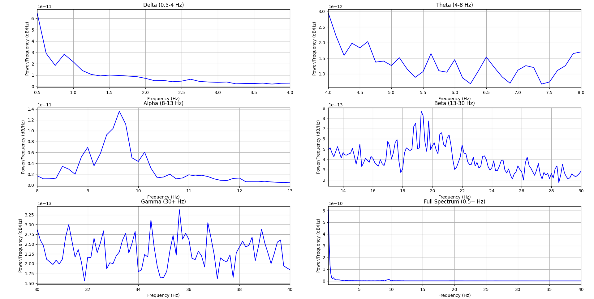
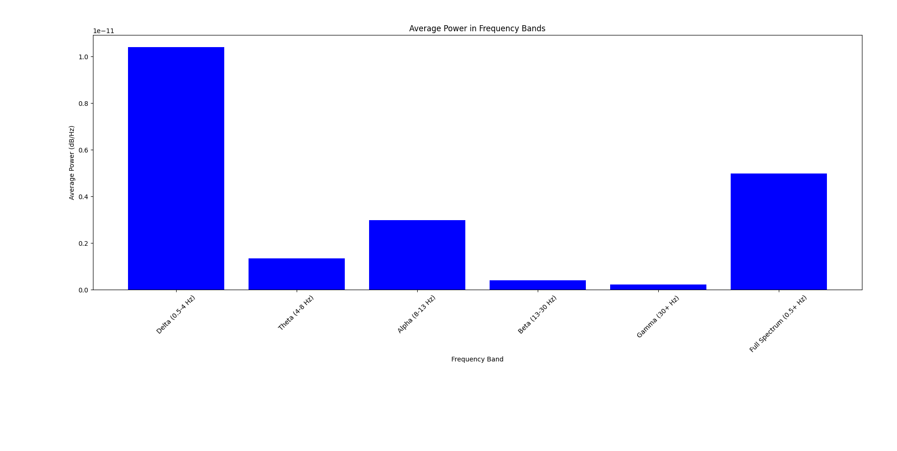
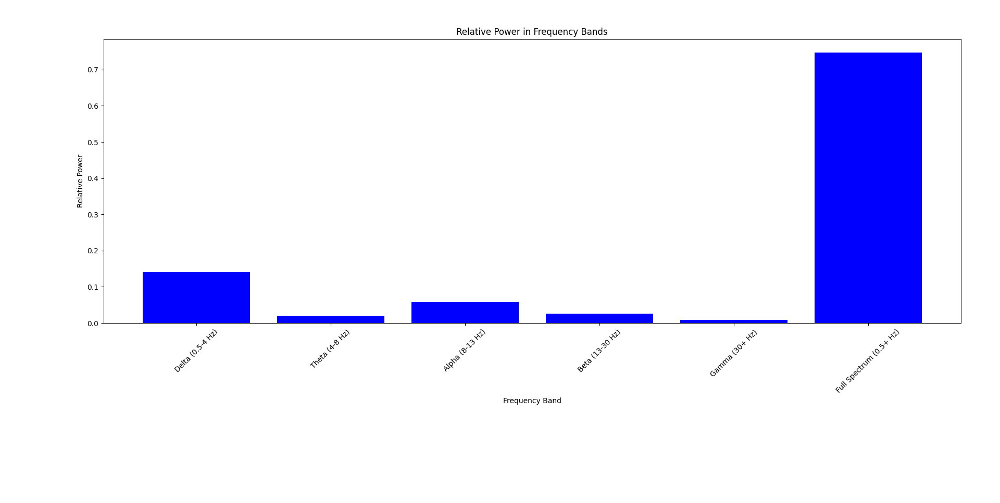
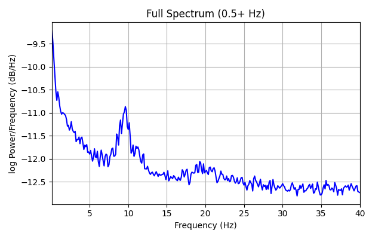

# Brain Wave Analyzer

A complete application with FastAPI backend and Streamlit frontend that analyzes and visualizes brainwaves from EDF files.

## Project Structure

```
brain-wave-analyzer/
├── src/
│   ├── backend.py        # FastAPI backend with analysis functions
│   └── frontend.py       # Streamlit frontend application
├── tests/
│   ├── backend/          # Backend tests
│   └── frontend/         # Frontend tests
│   
├── static/
│   └── figures/          # Generated plots saved here
├── backend.Dockerfile    # Docker configuration for API
├── frontend.Dockerfile   # Docker configuration for Streamlit
├── docker-compose.yml    # Docker Compose configuration
├── requirements-backend.txt
├── requirements-frontend.txt
├── .coveragerc           # Coverage configuration
└── run_tests.bat         # Script to run tests with coverage
```
## Getting the Application
 1. git clone the repo
 2. cd to the root of the project (brain-wave-analyzer)

## Running the Application

### With Docker (Recommended)

1. Make sure you have Docker installed (and that it is runnning)
2. Build and run the containers:
   ```
   docker-compose up --build
   ```
3. Access the frontend at: http://localhost:8501
4. The backend API is available at: http://localhost:8000

### Without Docker

#### Backend

1. Install backend dependencies 
   - With uv:
       ```
      uv sync --all-extras
      ```

   - With pip:
      ```
      pip install -r requirements-backend.txt
      ```
    
2. Run the backend:
   ```
   python src/backend.py
   ```
3. The API will be available at: http://localhost:8000

#### Frontend

1. Install frontend dependencies:
   - With uv:
      ```
      uv sync --all-extras
      ```

   - With pip:
      ```
      pip install -r requirements-frontend.txt
      ```
2. Run the frontend:
   ```
   streamlit run src/streamlit_app.py
   ```
3. The frontend will be available at: http://localhost:8501

## API Endpoints

- `GET /`: Welcome message
- `POST /analyze-edf/`: Upload and analyze an EDF file
  - Returns analysis results and URLs to plots

## Running Tests

The project includes comprehensive unit tests for both the frontend and backend using pytest.

### Install Testing Dependencies

```
pip install pytest pytest-cov pytest-mock httpx coverage
```

Or with uv:

```
uv sync --all-extras
```

### Run Tests with Coverage

Run all tests with coverage reporting:

```
python -m pytest tests -v --cov=src --cov-report=term --cov-report=html
```

Or use the included batch script:

```
run_tests.bat
```

### View Coverage Report

After running tests with coverage, you can open the HTML report:

```
start htmlcov\index.html
```

# Details on Implementation
## Loading and filtering

I've never worked with EEG data before but from what I could read on the internet the EEG data needs to be filtered to remove things such as:
- Signal from respiration 
- Signal from muscle artifact 
- Signal from power-line noise 

I mainly used  [this page as my source](https://neuraldatascience.io/7-eeg/erp_filtering.html).

So i guesstimated some ranges for these filters and applied them. 

## Calculating the PSD

Calculating the PSD was pretty straightforward using the mne library. I choose to display the mean of the channels in the PSD plot but I'm unsure if this is 'bad'.



## Comparing the power

Here i calculated the average power in each band:



And the relative power:



I found this section of interest in  [the link on 1/f](http://www.scholarpedia.org/article/1/f_noise)

_Linkenkaer-Hansen at el. (2001) showed that both MEG and EEG recordings of spontaneous neural activity in humans displayed 1/f-like power spectra in the α , μ , and β frequency ranges, although the exponents tended to be somewhat less than 1 and differed across the frequency ranges. They suggested that the power-law scaling they observed arose from self-organized criticality occurring within neural networks in the brain. It is possible, however, this inference is not necessarily warranted. One recent study (Bedard et al., 2006) showed that the 1/f scaling of brain local field potentials does not seem to be associated with critical states in the simultaneously-recorded neuronal activities, but rather arises from filtering of the neural signal through the cortical tissue._

We clearly see that the full spectrum has a 1/f trend and if we look at at log plot it becomes clear it follows a power law.



# TODO's

- Make the biomarkers which i find interesting
- Create the scalp map visualization of the biomarkers
- Create a pytest for the frontend
- Make a github action which runs the pytest online for every major commit